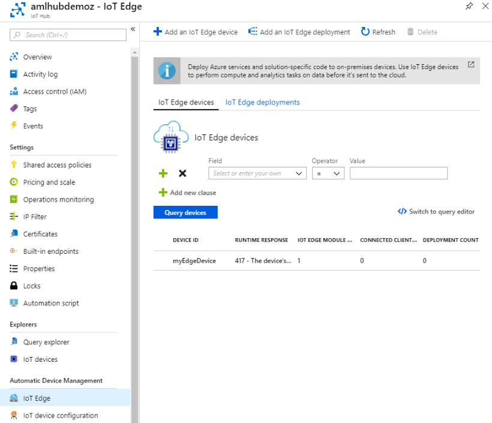
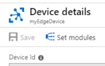
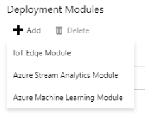

# Lab 6 - Model Deployment to IoT Edge

In this lab you deploy a trained model container to an IoT Edge device.

## Exercise 0 - Get the lab files
If you have not cloned this repository to your working environment, do so now. All of the artifacts for this lab are located under `starter-artifacts/visual-studio`.

## Exercise 1 - Get oriented to the lab files

1. Navigate to the directory where you cloned the repo and then open the solution `azure-ml-labs.sln`. 
2. With the solution open in Visual Studio, look at Solution Explorer and expand the project `06-deploy-to-iot-edge`.
3. Under that, expand Python Environments. You should see one environment called `AzureML (3.6, 64-bit)`. This Anaconda environment will be used when you execute code either by running the script using F5 or by executing Python code in the Python Interactive Window.
4. Observe the project includes the files needed to create a container image for scoring:  `iot_score.py` (the scoring script), `myenv.yml` (the conda dependencies to be installed in the container), and `model.pkl` (a previosuly trained anomaly detection model).
5. Open `_06_deploy_to_iot_edge.py`. This is the Python file you will step thru executing in this lab. Leave it open and continue to the next exercise.


## Exercise 2 - Provision an IoT Edge Device and IoT Hub
In this exercise, you will provision an Ubuntu Linux Virtual Machine that will act as your IoT Edge device. You will perform the following steps using the Azure CLI. 
1. Open the command prompt. 
2. Confirm the selected subscription used by the Azure CLI is the desired one by running:
```
az account show
```
3. If the subscription is not set correctly, change it by updating the following with your `Subscription Name` or `Subscription ID` and running it.
```
az account set --subscription "Demo Creation"
```
4. You will need to use the Azure IoT extension to the Azure CLI. Run the following command to install it.
```
az extension add --name azure-cli-iot-ext
```
5. Next, create a Resource Group that will contain the IoT Edge related resources.  
```
az group create --name IoTEdgeResources --location westus2
```
6. Run the following command to create an Azure Virtual Machine that will act as your IoT Edge device. From the command output take note of the value `publicIpAddress`. You will need this IP address later to use SSH to connect to the VM.
```
az vm create --resource-group IoTEdgeResources --name EdgeVM --image Canonical:UbuntuServer:16.04-LTS:latest --admin-username azureuser --generate-ssh-keys --size Standard_DS1_v2
```
7. Your IoT edge device will be managed thru an IoT Hub. This IoT Hub will also be the target to where your IoT Edge device will send its telemetry. Run the following to create an IoT Hub in the Resource Group you created previously. Be sure to repalce the `{hub_name}` attribute with a unique value, and if necessary change the SKU from `F1` free tier to `S1` if you already have a free-tier instance deployed in your subscription.
```
az iot hub create --resource-group IoTEdgeResources --name {hub_name} --sku F1
```
8. Next you will create a digital identity for your IoT Edge device. Run the following command to create this identity in your IoT Hub.
```
az iot hub device-identity create --hub-name {hub_name} --device-id myEdgeDevice --edge-enabled
```
9. Your IoT Edge device will need to be configured with a connection string that uniquely identifies it to IoT Hub. Run the following command to retrieve this connection string and copy it down for use later.
```
az iot hub device-identity show-connection-string --device-id myEdgeDevice --hub-name {hub_name}
```

## Exercise 3 - Configure your IoT Edge device VM
The IoT Edge runtime is needed by any IoT Edge devices. In this exercise you will install and configure the various components of the runtime.
1. Connect to your VM via SSH, using the `publicIpAddress` you acquired previously.
```
ssh azureuser@{publicIpAddress}
```
2. Create the software repository cofniguration needed for acquiring the IoT Edge runtime and register the public key needed to access the repository.
```
curl https://packages.microsoft.com/config/ubuntu/16.04/prod.list > ./microsoft-prod.list
sudo cp ./microsoft-prod.list /etc/apt/sources.list.d/
curl https://packages.microsoft.com/keys/microsoft.asc | gpg --dearmor > microsoft.gpg
sudo cp ./microsoft.gpg /etc/apt/trusted.gpg.d/
```
3. Install the container runtime by executing the following:
```
sudo apt-get update
sudo apt-get install moby-engine
sudo apt-get install moby-cli
```
4. Install the IoT Edge security daemon by running the following.
```
sudo apt-get update
sudo apt-get install iotedge
```
5. Get the IP address of the docker0 interface by running `ifconfig`. The output should be similar to the following. You want the value that follows inet addr (which is 172.17.0.1 in the below example). 
```
....
docker0   Link encap:Ethernet  HWaddr 02:42:30:d8:7f:e9
          inet addr:172.17.0.1  Bcast:172.17.255.255  Mask:255.255.0.0
....
```
6. Open the config.yaml file which contains the IoT Edge configuration in the nano editor. 
```
sudo nano /etc/iotedge/config.yaml
```
7. Locate the line of code that looks like the following:
```
provisioning:
  source: "manual"
  device_connection_string: "<ADD DEVICE CONNECTION STRING HERE>"
```
8. In the value for `device_connection_string` paste the connection string you acquired from your IoT Hub for your Edge device. 
9. While in preview, Azure Machine Learning does not support the process identification security feature enabled by default with IoT Edge and you need to perform the following two steps to disable it.
10. Update the connect section of the configuration with your docker IP address. For example:
```
connect:
  management_uri: "http://172.17.0.1:15580"
  workload_uri: "http://172.17.0.1:15581"
```
11. Enter the same docker IP addresses in the listen section of the configuration. For example:
```
listen:
  management_uri: "http://172.17.0.1:15580"
  workload_uri: "http://172.17.0.1:15581"
```
12. Then save and close the file by pressing `CTRL + X`, `Y`, `ENTER`.
13. Apply the changes by restarting the IoT Edge security daemon.
```
sudo systemctl restart iotedge
```
14. Verify the status of your IoT Edge service by running (for the Active attribute, the value should read `Active: active(running)`):
```
sudo systemctl status iotedge
```
15. You can view the list of initial modules (containers) that are runnning on your device by executing:
```
sudo iotedge list
```
16. Your device is now configured and ready to receive cloud-deployed modules. 

## Exercise 4 - Prepare the Azure Machine Learning module
In this exercise you will use a previously trained model using the Azure Machine Learning SDK and deploy it along with a scoring script to an image. This model will score temperature telemetry data for anomalies. In a subsequent exercise, you will deploy this module to your IoT Edge device to perform scoring on the device. 
1. Return to Visual Studio and `_06_deploy_to_iot_edge.py`. 
2. In Step 1, you will create a new or retrieve an existing Azure Machine Learning Workspace as has been demonstrated in previous labs. Select all of the code for Step 1 and type `Control + Enter` to execute the selected code in the Python Immediate Window.
3. With a Workspace in hand you are ready to build a container that wraps your model. This consists of three steps- creating a ContainerImage, registering the Model and creating an Image. Select and execute Step 2 and wait for it to complete. When it is finished you will have a Docker container image that you will be able to deploy to your IoT Edge device.

## Exercise 5 - Deploy the modules
In this exercise you will deploy 2 modules to your IoT Edge device. One is a telemetry generator that will produce simulated temperature readings and the other will be an Azure Machine Learning module that will perform anomaly detection. 
1. Navigate to the Azure Portal in your browser and locate your IoT Hub.
2. Select **IoT Edge** under Automatic Device Management and select your IoT Edge device.

3. Select **Set modules**. A three-step wizard opens in the portal, which guides you through adding modules, specifying routes, and reviewing the deployment.

4. In the Add Modules step of the wizard, find the Deployment Modules section. Click Add then select IoT Edge Module.

5. In the Name field, enter `tempSensor`.
6. In the Image URI field, enter `mcr.microsoft.com/azureiotedge-simulated-temperature-sensor:1.0`. This image is available from  Microsoft supplied container registry.
7. Leave the other settings unchanged, and select Save.

8. Next you will add the machine learning module that you created.
9. Under Deployment Modules, select Add.
10. This time select Azure Machine Learning Module.
11. In the Deployment Name field, enter `machinelearningmodule`.
12. In the Subscription, select the Azure Subscription that contains your Azure Machine Learning Workspace.
13. From the Workspace dropdown, select your Azure Machine Learning Workspace.
14. From the Image dropdown, select the machine learning image you recently deployed.

15. Select Next.
16. Back in the Set Modules step, select **Next**.
17. In the Specify Routes step, copy the JSON below into the text box. The first route transports messages from the temperature sensor to the machine learning module via the "amlInput" endpoint, which is the endpoint that all Azure Machine Learning modules use. The second route transports messages from the machine learning module to IoT Hub. In this route, `amlOutput` is the endpoint that all Azure Machine Learning modules use to output data, and `$upstream` denotes IoT Hub.
```
{
    "routes": {
        "sensorToMachineLearning":"FROM /messages/modules/tempSensor/outputs/temperatureOutput INTO BrokeredEndpoint(\"/modules/machinelearningmodule/inputs/amlInput\")",
        "machineLearningToIoTHub": "FROM /messages/modules/machinelearningmodule/outputs/amlOutput INTO $upstream"
    }
}
```
10. Select Next.
11. In the Review Deployment step of the wizard, select **Submit**.
12. Return to the device details page and select **Refresh**. In addition to the edgeAgent module that was created when you first started the service, you should see another runtime module called edgeHub and the tempSensor and machinelearningmodule listed. It may take about 5-10 minutes for the two new modules to appear and start running. Once you see a Runtime Status of Running for all modules you can proceed.

## Exercise 6 - Examine the scored messages
You can view messages being generated by each IoT Edge module, and you can view messages that are delivered to your IoT hub.

1. Return to your SSH session connected to your IoT Edge VM. 
2. View the list of modules on your device be running the following.
```
sudo iotedge list
```
3. View the simulated telemetry messages being sent by the `tempSensor` module by running the following command.
```
iotedge logs tempSensor -f
```
4. View the anomaly detection scored messages being sent by the `machinelearningmodule` by running the following command.
```
iotedge logs machinelearningmodule -f
```


 

